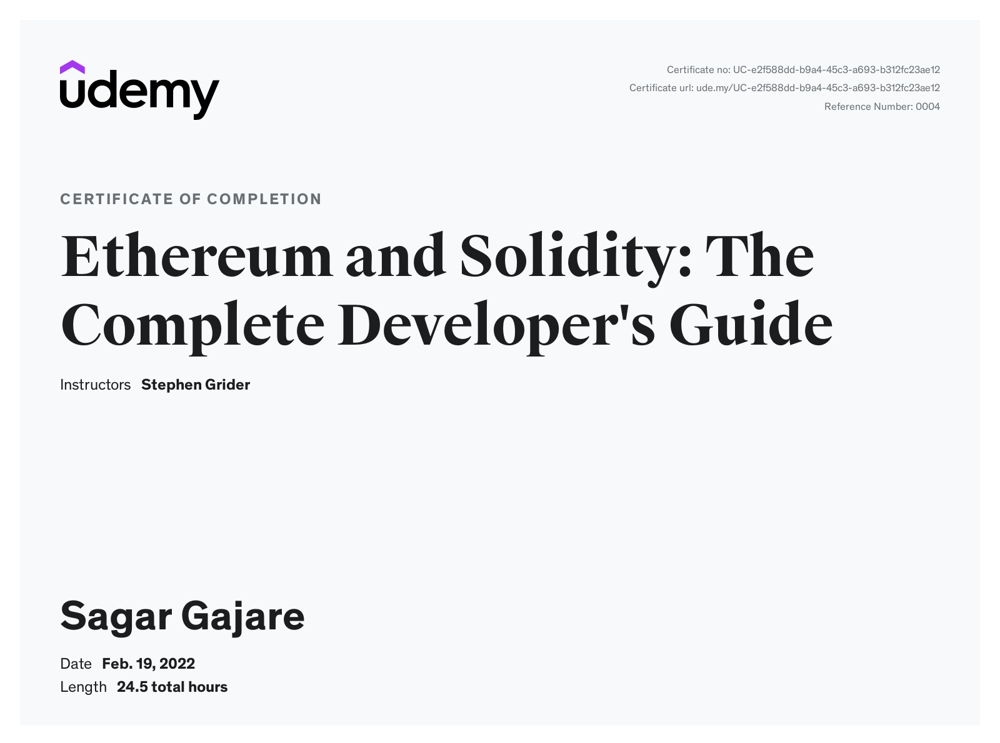

## Ethereum and Solidity: The Complete Developer's Guide

### Learnings

1. [Ethereum](https://ethereum.org/) is a decentralized platform that runs smart contracts.
2. [Solidity](https://solidity.readthedocs.io/) is a programming language for smart contracts.
3. [web3.js](https://web3js.readthedocs.io/) is a library for interacting with Ethereum.
4. [Nextjs](https://nextjs.org/) is a framework for building single-page applications.
5. [Semantic-UI](https://semantic-ui.com/) is a UI library for React.]]

Certificate:

